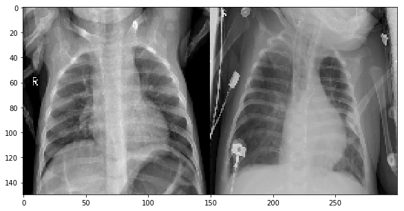
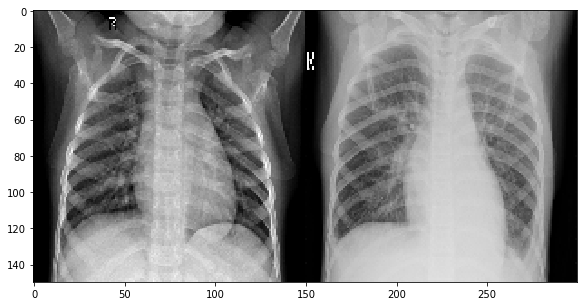
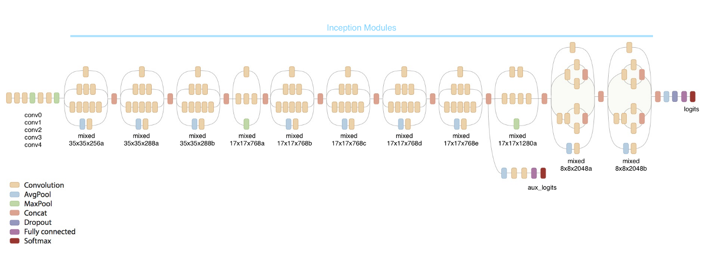

# Pneumonia-Diagnosis-using-XRays-96-percent-Recall

## BEST SCORE ON KAGGLE SO FAR , EVEN BETTER THAN THE KAGGLE TEAM MEMBER WHO DID BEST SO FAR. 
 
### Left - No Pneumonia----------------------------------Right - Pneumonia
 
### InceptionV3 Architecture for Transfer Learning.


**The project is about diagnosing pneumonia from XRay images of lungs of a person using self laid convolutional neural network and tranfer learning via inceptionV3. The images were of size greater than 1000 pixels per dimension and the total dataset was tagged large and had a space of 1.2 Gb . My work includes self laid neural network which was repeatedly tuned for one of the best hyperparameters and used variety of utility function of keras like callbacks for learning rate reduction and checkpointing. Could have augmented the image data for even better modelling but was short of RAM on kaggle kernel. Other metrics like precision , recall and f1 score using confusion matrix were taken off special care. The other part included a brief introduction of transfer learning via InceptionV3 and was tuned entirely rather than partially after loading the inceptionv3 weights for the maximum achieved accuracy on kaggle till date. This achieved even a higher precision than before.** 
  
# License
MIT License
```
Copyright (c) 2018 Rohit Verma

Permission is hereby granted, free of charge, to any person obtaining a copy
of this software and associated documentation files (the "Software"), to deal
in the Software without restriction, including without limitation the rights
to use, copy, modify, merge, publish, distribute, sublicense, and/or sell
copies of the Software, and to permit persons to whom the Software is
furnished to do so, subject to the following conditions:

The above copyright notice and this permission notice shall be included in all
copies or substantial portions of the Software.

THE SOFTWARE IS PROVIDED "AS IS", WITHOUT WARRANTY OF ANY KIND, EXPRESS OR
IMPLIED, INCLUDING BUT NOT LIMITED TO THE WARRANTIES OF MERCHANTABILITY,
FITNESS FOR A PARTICULAR PURPOSE AND NONINFRINGEMENT. IN NO EVENT SHALL THE
AUTHORS OR COPYRIGHT HOLDERS BE LIABLE FOR ANY CLAIM, DAMAGES OR OTHER
LIABILITY, WHETHER IN AN ACTION OF CONTRACT, TORT OR OTHERWISE, ARISING FROM,
OUT OF OR IN CONNECTION WITH THE SOFTWARE OR THE USE OR OTHER DEALINGS IN THE
SOFTWARE. ```


   
       
  
  
 
  
